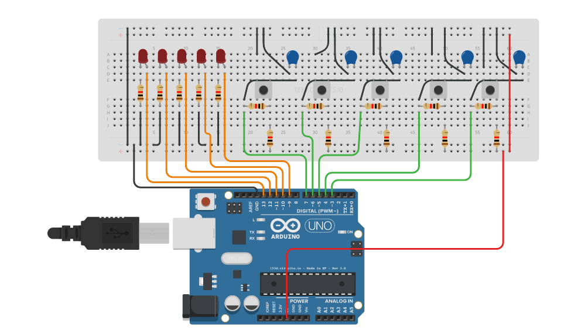

# ActuatorCircuit
This repository is for an actuator circuit design that can be used in opening and closing valves, controlling a light show, fireworks, sprinklers, using a controlled sequences of on and off controls. 

<h2>Ideation</h2>
So a friend of mine was designing an automated controller to use in a startup, it was to control a series of valves in a particular sequence. So I decided to prototype the device shown below in a lunch break.

<h2>The Initial Prototype</h2>
Link to prototype: <a href="https://123d.circuits.io/circuits/2335416-button-controlled-actuator">prototype</a>

<h2>The Prototype Circuit</h2>
 
<h3>Notes</h3>
Notes on the circuit diagram above

-Orange:&nbsp;&nbsp;&nbsp;&nbsp;Outputs to Relays, in this case LED's  
-Green:&nbsp;&nbsp;&nbsp;&nbsp;&nbsp;&nbsp;Inputs from buttons, buttons are debounced in the hardware  
-Black:&nbsp;&nbsp;&nbsp;&nbsp;&nbsp;&nbsp;&nbsp;Ground  
-Red:&nbsp;&nbsp;&nbsp;&nbsp;&nbsp;&nbsp;&nbsp;&nbsp;&nbsp;&nbsp;5V  

